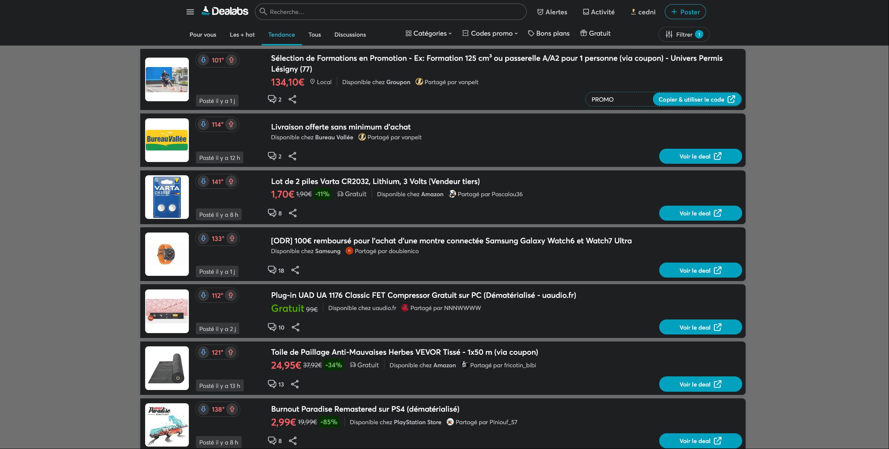
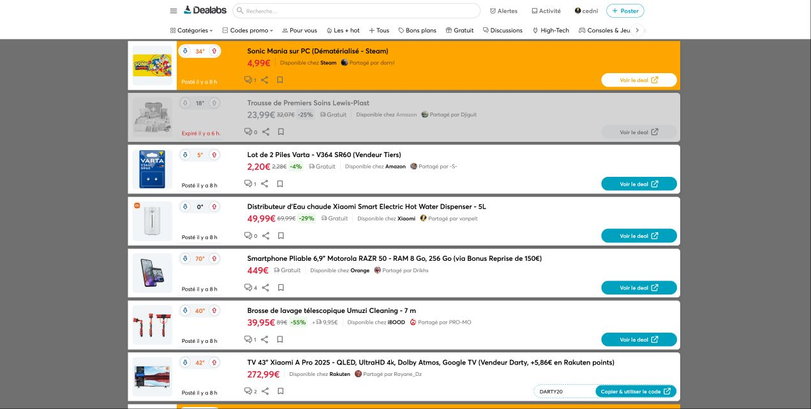
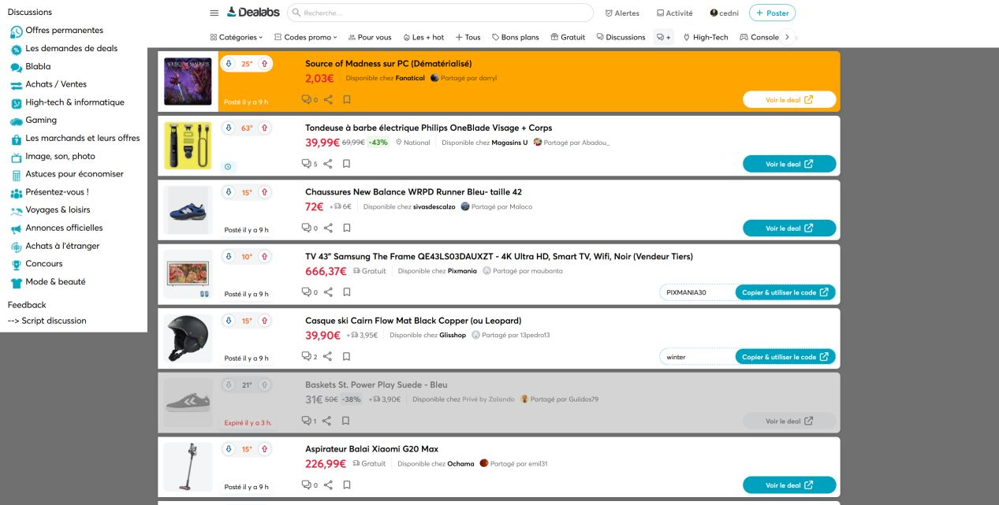

Mises à jour
   # 0.02:
 Mise à jour des // @include
 
   ## 0.03:
 Ajout des url d'update
 
   ### 0.05:
 Utilisation de MutationObserver au lieu de DOMNodeInserted
 
   ### 0.06:
 Menu sur une seule ligne
 Ne traiter que les articles non modifiés
 Ajout du lien discussions dans le menu
 
   ### 0.07:
 Autre approche, ajouter une balise style
 
   ### 0.08:
 Un peu de css, voir le screenshot
 
   ### 0.09:
 Des filtres basés sur le contenu avec du css uniquement
 
 Orange correspond à un de mes filtres regroupant les marchands de jeux PC
 Vert pour la Xbox
 Fade - pour les deals expirés
 Fade + pour les deals avec de la lingerie ou des jouets pour adultes( j'ai vu que la demande était passée pour ce type de filtre)
 
   ### 0.10:
 Cosmétique
 
   ### 0.11
 Cosmétique
 Les deals destinés au adultes ne sont plus cachés, juste la photo.
 
   ### 0.12:
 Simplification des includes
 Ajout d'une exclusion https://www.dealabs.com/submission*
 Suite à la nouvelle apparence du premier menu, j'incruste ceux de la deuxiéme ligne
 
   ### 0.15:
 Ajout d'un menu pour les différentes catégories des discussions qui s'ouvre en haut à gauche
 Amélioration des filtres, possibilité de cibler un ensemble de mots 
 Exemple  : [["walkman",["drone","cam"],["tv","45","oled"],"skate""],"   ###5fcdf5","keywords","   ###000000"] 
 Résultat : 
 un walman 
 un drone muni d'une camera
 une tv oled de 45 pouces   !! pas de guillemets
 un skate
 Couleur de fond en bleu
 
   ### 0.16:
 Réorganisarion du code
 Les images cachées apparaissent au survol
 
   ### 0.18:
 Optimisation de la fonction filtre perso
 - filtre pour mot ou groupe de mots, statut ok.
 - filtre pour mot ou groupe de mots en ignorant certains termes, statut ok.
 
0.19
 Ajout de 2 variables ( 1 pour activer le filtre )
 - VarApplyMyAdultFilter 
 - VarApplyMyfilters 
 
 Amélioration de la fonction filtre perso, renommée en applyFilters()
  Que sait-on à propos des url ?
  - pas les même termes que les title
  - pas d'accents
  - tout en minuscule
  - chaque mot est suivi d'un tiret    
  
  3 exemples:
  - https://www.dealabs.com/bons-plans/ensemble-sommier-lit-140-190-123456789
  - https://www.dealabs.com/bons-plans/table-basse-123456789
  - https://www.dealabs.com/bons-plans/pc-portable-123456789   
 
  !! Limite : [href*="'table-" i]';   
 
  Solution:
  - changement du selecteur  [title~="table" i]' (mot complet) au lieu de * (chaine dans un mot) 
 
0.20
 Amélioration de la fonction filtre perso
  Que sait-on à propos des url ?
  - pas les même termes que les title
  
  Exemple:
  !! https://www.dealabs.com/bons-plans/pc-portable-gamer-erazer-deputy-p60-156-fhd-144hz-i7-12650h-16go-ssd-512go-rtx-4070-livre-sans-windows-3007406
  Présence de virgules.
  En cherchant 4070: 
  - ok pour l'url: pc-portable-gamer-erazer-deputy-p60-156-fhd-144hz-i7-12650h-16go-ssd-512go-rtx-4070-livre-sans-windows-3007406
  - pas ok pour le title: PC Portable 15,6" Erazer Deputy P60 - FHD 144Hz, i7-12650H, 16 Go ram, SSD 512 Go, RTX 4070, Sans OS 
 
  Solution:
  ,[title~="4070" i][href*="4070-" i]
  devrait être 
  ,[title~="4070" i],[href*="4070-" i]
 
 
 
   ### screenshot
 [1](/ori.png)
 
   ### screenshot
 
 
   ### screenshot
 
 
   ### screenshot
 
 
   ### screenshot
 
 
