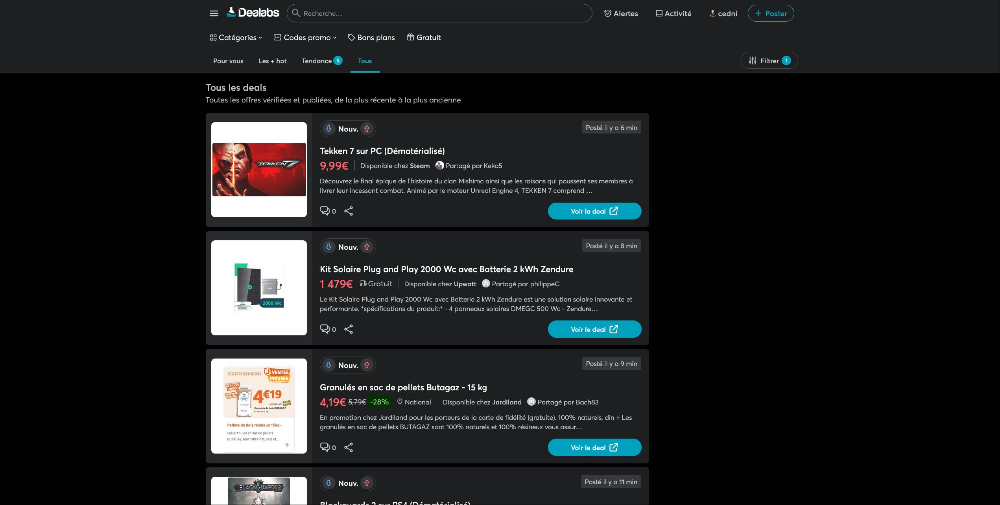

C'est un userscript à charger avec une extension dans un navigateur WEB. 
Il s'applique à dealabs.

Il permet d'afficher plus d'articles à l'écran
et peut mettre en valeur des articles en utilisant des filtres.

Release notes

Userscript: 
https://greasyfork.org/fr/scripts/526927-dealabs-css

Github pour les anciennes versions 
https://github.com/cednieb/dealabs_css_2025

Mises à jour

## 0.02:
Mise à jour des // @include

## 0.03:
Ajout des url d'update

## 0.05:
Utilisation de MutationObserver au lieu de DOMNodeInserted

## 0.06:
Menu sur une seule ligne 
Ne traiter que les articles non modifiés 
Ajout du lien discussions dans le menu 

## 0.07:
Autre approche, ajouter une balise style

## 0.08:
Un peu de css, voir le screenshot

## 0.09:
Des filtres basés sur le contenu avec du css uniquement 
- Orange correspond à un de mes filtres regroupant les marchands de jeux PC
- Vert pour la Xbox
- Fade - pour les deals expirés
- Fade + pour les deals avec de la lingerie ou des jouets pour adultes( j'ai vu que la demande était passée pour ce type de filtre)

## 0.10:
Cosmétique

## 0.11
Cosmétique 
Les deals destinés au adultes ne sont plus cachés, juste la photo.

## 0.12:
Simplification des includes 
Ajout d'une exclusion https://www.dealabs.com/submission* 
Suite à la nouvelle apparence du premier menu, j'incruste ceux de la deuxiéme ligne

## 0.15:
Ajout d'un menu pour les différentes catégories des discussions qui s'ouvre en haut à gauche 
Amélioration des filtres, possibilité de cibler un ensemble de mots   
<ins>Exemple  :</ins> [["walkman",["drone","cam"],["tv","45","oled"],"skate""],"###5fcdf5","keywords","###000000"]   
<ins>Résultat :</ins>
- un walman 
- un drone muni d'une camera
- une tv oled de 45 pouces   !! pas de guillemets
- un skate
- Couleur de fond en bleu

## 0.16:
Réorganisarion du code 
Les images cachées apparaissent au survol

## 0.18:
Optimisation de la fonction filtre perso 
- filtre pour mot ou groupe de mots, statut ok.
- filtre pour mot ou groupe de mots en ignorant certains termes, statut ok.

## 0.19
Ajout de 2 variables ( 1 pour activer le filtre ) 
- VarApplyMyAdultFilter 
- VarApplyMyfilters 

Amélioration de la fonction filtre perso, renommée en applyFilters() 
 <ins>Que sait-on à propos des url ?</ins>
 - pas les même termes que les title
 - pas d'accents
 - tout en minuscule
 - chaque mot est suivi d'un tiret    
 
 <ins>3 exemples:</ins>
 - https://www.dealabs.com/bons-plans/ensemble-sommier-lit-140-190-123456789
 - https://www.dealabs.com/bons-plans/table-basse-123456789
 - https://www.dealabs.com/bons-plans/pc-portable-123456789   

 !! Limite : [href*="'table-" i]';   

 <ins>Solution:</ins>
 - changement du selecteur  [title~="table" i]' (mot complet) au lieu de * (chaine dans un mot) 

## 0.20
Amélioration de la fonction filtre perso 
 <ins>Que sait-on à propos des url ?</ins>
 - pas les même termes que les title
 
 <ins>Exemple:</ins> 
 !! https://www.dealabs.com/bons-plans/pc-portable-gamer-erazer-deputy-p60-156-fhd-144hz-i7-12650h-16go-ssd-512go-rtx-4070-livre-sans-windows-3007406 
 Présence de virgules.  
 En cherchant 4070: 
 - ok pour l'url: pc-portable-gamer-erazer-deputy-p60-156-fhd-144hz-i7-12650h-16go-ssd-512go-rtx-4070-livre-sans-windows-3007406
 - pas ok pour le title: PC Portable 15,6" Erazer Deputy P60 - FHD 144Hz, i7-12650H, 16 Go ram, SSD 512 Go, RTX 4070, Sans OS 

 <ins>Solution:</ins>
 ,[title~="4070" i][href*="4070-" i]
 devrait être 
 ,[title~="4070" i],[href*="4070-" i]

# Screenhots

